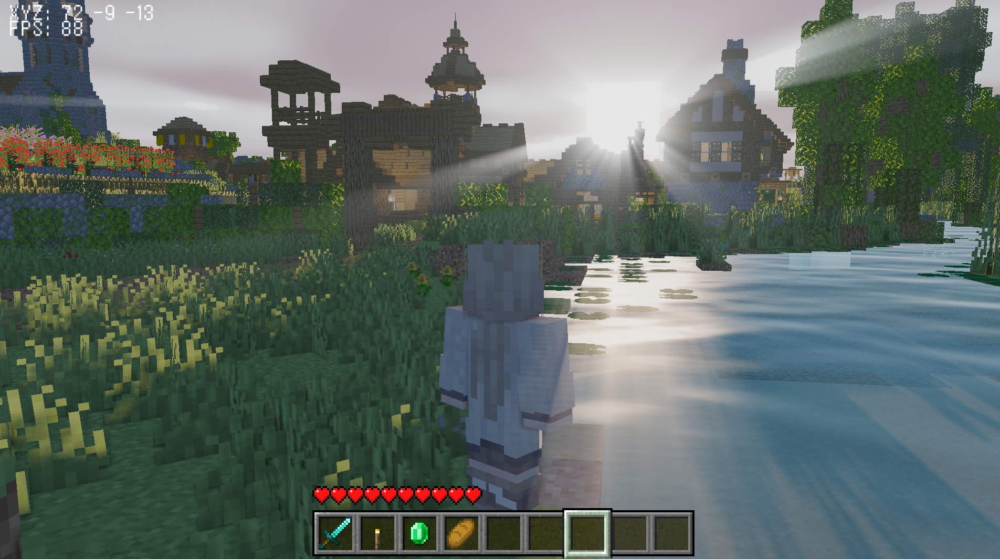
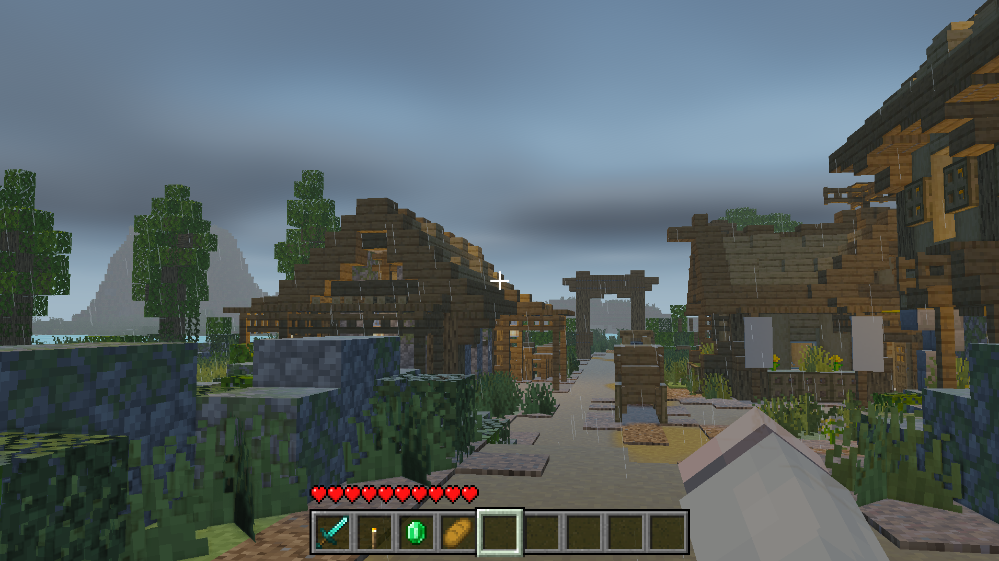
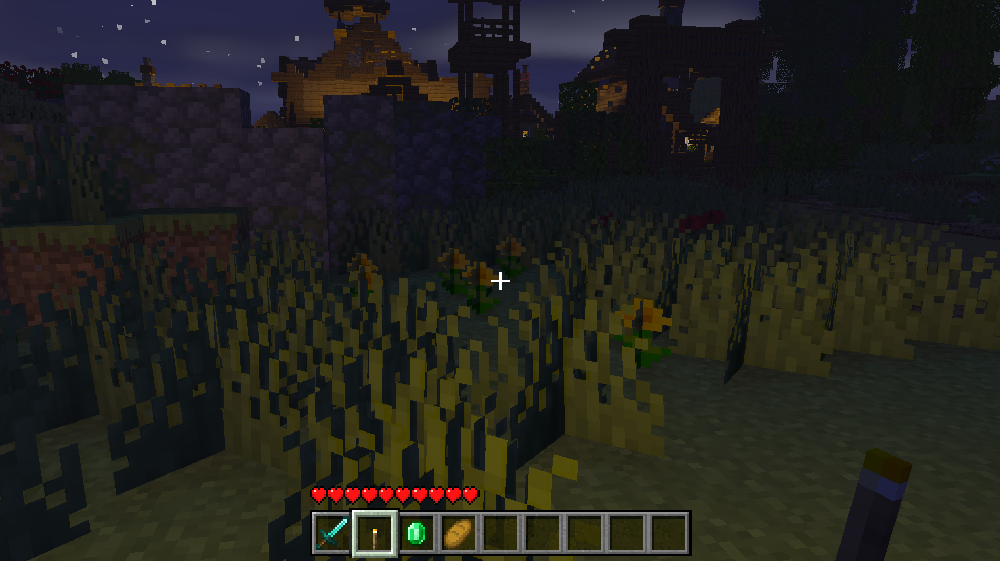

# 🎮 Modern OpenGL 3D Rendering Framework / 基于现代 OpenGL 的 3D 渲染框架

> A forward rendering architecture featuring lightweight PBR, custom physics, and post-processing.

<p align="center">
  
  
  
  
  
</p>

---

## 📖 项目简介

本项目是一个**使用现代 C++20 和 OpenGL 4.6 Core Profile 从零实现的 3D 渲染器**。每一行着色器代码、每一个矩阵运算、每一段物理逻辑均为从零开始借助AI实现，不依赖任何成品图形中间件。

### 核心特性

| 类别 | 特性 |
|------|------|
| **光照与阴影** | 动态昼夜循环 + 月光阴影、4096² Poisson Disk 16 采样软阴影、512 个动态点光源 + 手持火把 |
| **后处理管线** | HDR (RGBA16F) → Reinhard → ACES 电影级色调映射 → Gamma 2.4、双通道高斯 Bloom、SSAO 三阶段环境光遮蔽、60 步屏幕空间 God Rays |
| **水体与特效** | 顶点波浪动画 + 有限差分法线扰动 + Fresnel 反射 + 太阳耀斑、植被风摆（2 种模式）、10000 雨滴 VBO-less GPU 粒子 + 深度剔除防漏雨 |
| **程序化天空** | 体积云 (16+2 步 Marching)、网格化哈希星空 (Anti-Flicker)、Minecraft 风格方块日月、晨昏渐变 |
| **骨骼动画** | 双轨混合 (Base + Overlay)、头部追踪、第一人称头部隐藏、绑定姿态注入修复、无限循环 |
| **角色物理** | 手写运动学控制器 (6 阶段)、Möller–Trumbore 射线碰撞、2D 空间哈希加速、防隧道效应 |
| **战斗系统** | 精准准星射线判定 (Slab AABB)、横扫之刃 AOE、箭矢抛物弹道、受击闪红 + 击退 |
| **双类型 AI** | 僵尸 (追击 + 撕咬)、骷髅 (远程射击 + 后退风筝)、双轨动画混合 |
| **中文 UI** | stb_truetype 烘焙 21,000+ 汉字 (8192² GL_RED 图集)、像素级对齐 HUD、UTF-8 解码 |
| **故事系统** | 6 阶段脚本化线性叙事 (纯代码驱动)、电影级过场、对话/消息系统 |
| **3D 音效** | miniaudio 引擎、MP3 解码 + 空间定位、8+ 音效文件 |
| **Shader 热重载** | F1 全 Shader 热重载、编译失败旧程序保留不崩溃 |

---

## 📋 项目定位与开发声明 (Project Context & Disclaimer)

本项目是我在学习计算机图形学与 C++ 系统架构时的一个实践性渲染框架项目。

在本项目开发过程中，我深度实践了 **AI 辅助编程** 工作流。项目中的大部分核心数学推导（如 SSAO 的半球采样、体积云的光线步进积分、泊松圆盘滤波等）和着色器底层实现，是由我配合AI进行宏观系统设计与算法拆解后，依托 AI 工具（Claude）协助编写与优化的。

### 我的核心工作与收获集中在：

- **系统工程与管线架构**：统筹并打通了物理碰撞、双轨动画、后处理 FBO 链条与 UI 事件系统的复杂交互，处理了大量管线状态泄露与渲染排序问题，指出逻辑漏洞并引导 AI 修复。
- **DCC 资产管线集成**：解决了建模软件（Blockbench/Blender）导出至 OpenGL 渲染框架中的各类骨骼坍缩、法线错位及顶点色烘焙难题。
- **AI Prompt 工程实践**：通过将复杂的 3D 渲染需求拆解为一个个小型数学公式与逻辑，验证了 AI 在大型 C++ 图形项目中的代码生成边界与重构能力。

本仓库仅作为我个人的学习与技术探索进程记录。

---

## 🖥️ 运行截图





---

## ⚙️ 编译环境

| 需求 | 说明 |
|------|------|
| **操作系统** | Windows 10 / 11（仅支持 Windows） |
| **编译器** | MSVC 2026 (Visual Studio 2026 18.6.1)，含"使用 C++ 的桌面开发"工作负载 |
| **CMake** | 3.16 或更高版本 |
| **构建工具** | Ninja（可通过 VS Installer 安装或从 [ninja-build.org](https://ninja-build.org) 下载） |
| **GPU** | 支持 OpenGL 4.6 Core Profile 的显卡（NVIDIA GTX 900+ / AMD GCN 4th Gen+） |

### 验证环境

打开 **x64 Native Tools Command Prompt for VS 2026**，执行：

```bash
cmake --version    # ≥ 3.16
ninja --version    # 任意版本
cl                 # 应显示 MSVC 版本信息
```

---

## 📦 依赖库

项目使用随源码分发的第三方库，通过 `external/` 目录组织。**由于 GitHub 不提交第三方库源文件（见 `.gitignore`），你需要自行获取以下依赖：**

### 依赖清单

| 库 | 版本 | 用途 | 获取方式 |
|----|------|------|---------|
| **GLFW** | 3.4.0 | 窗口创建、输入处理 | <https://www.glfw.org/download.html> → 源码包，解压至 `external/glfw/` |
| **GLAD** | GL 4.6 Core | OpenGL 函数加载器 | <https://glad.dav1d.de/> → Language: C/C++, GL 4.6 Core → 生成后解压至 `external/glad/` |
| **GLM** | latest | 数学库 (矩阵/向量/四元数) | <https://github.com/g-truc/glm> → 仅头文件，放置于 `external/glm/` |
| **Assimp** | latest | 3D 模型导入 (.glb/.fbx/.obj) | <https://github.com/assimp/assimp> → 源码，放置于 `external/assimp/` |
| **stb** | latest | 图像加载 (stb_image.h) | <https://github.com/nothings/stb> → `stb_image.h` 放至 `external/stb/` |

**注意**：`external/` 下的目录结构应与 CMakeLists.txt 中的路径一致：

```
external/
├── glad/
│   ├── include/   (glad/glad.h, KHR/khrplatform.h)
│   └── src/       (glad.c)
├── glfw/          (GLFW 完整源码)
├── glm/           (GLM 头文件)
├── assimp/        (Assimp 完整源码)
└── stb/           (stb_image.h + CMakeLists.txt)
```

---

## 🔨 编译步骤

### 1. 克隆仓库

```bash
git clone https://github.com/<你的用户名>/<仓库名>.git
cd OpenGL
```

### 2. 解压地图文件

由于 GitHub 对单文件有 100 MB 限制，`map.glb`（大地图模型）以 `zip` 格式存储：

```bash
# 进入 models 目录
cd models

# 解压地图（PowerShell）
Expand-Archive -Path map.zip -DestinationPath .

# 或使用 7-Zip
7z x map.zip

cd ..
```

> 解压后 `models/` 目录下应出现 `map.glb` 文件。`map.zip` 可保留或删除。

### 3. 获取外部依赖

按照上方"依赖清单"表格，将所有第三方库放置于 `external/` 目录。

### 4. 配置 CMake

```bash
# x64 Debug（推荐开发使用）
cmake --preset x64-debug

# 其他可用预设
# cmake --preset x64-release   (64 位发布版)
# cmake --preset x86-debug     (32 位调试版)
# cmake --preset x86-release   (32 位发布版)
```

### 5. 编译

```bash
cmake --build out/build/x64-debug
```

### 6. 运行

```bash
.\out\build\x64-debug\OpenGL\OpenGL.exe
```

程序将以 1920×1080 窗口启动，默认显示主菜单。

---

## 🕹️ 操作说明

| 按键 | 功能 |
|------|------|
| **W A S D** | 移动（W 前进 / S 后退 / A D 左右平移） |
| **鼠标** | 旋转视角（俯仰 -89° ~ +89°） |
| **空格** | 跳跃 |
| **左 Ctrl** | 切换奔跑/步行模式（持续切换，奔跑仅 W 向前时激活） |
| **左 Shift** | 潜行（按住） |
| **鼠标左键** | 近战攻击（范围 3.5m，剑 7 伤 + 横扫 AOE / 空手 1 伤） |
| **鼠标右键** | 射箭 / 手持面包时按住吃饭（HP<20 时回 4 HP） |
| **滚轮** | 循环切换快捷栏（0–8） |
| **1–9** | 直接选择快捷栏槽位 |
| **F1** | 热重载全部着色器 |
| **F2** | 打开时间选择面板（正午/黄昏/午夜/清晨） |
| **F3** | 调试信息覆盖层（坐标 + FPS） |
| **F5** | 切换相机模式（第一人称/第三人称后/第三人称前） |
| **F6** | 碰撞调试线框 |
| **R** | 切换降雨 |
| **T** | 聊天历史面板 |
| **Esc** | 退出程序 |

---

## 📂 项目结构

```
OpenGL/
├── CMakeLists.txt              # 顶层 CMake（第三方库配置）
├── CMakePresets.json           # 构建预设（x64/x86 × Debug/Release）
├── OpenGL/                     # CMake 可执行目标
│   └── CMakeLists.txt          # 源文件列表 + POST_BUILD 资源复制
├── src/                        # 项目源代码（见下方说明）
├── shaders/                    # GLSL 着色器（*.vert / *.frag，20+ 个文件）
├── models/                     # 3D 模型文件（*.glb）
│   ├── map.zip                 # 大地图（需解压，见编译步骤）
│   ├── player.glb              # 玩家模型
│   ├── zombie.glb              # 僵尸模型
│   ├── skeleton.glb            # 骷髅模型
│   └── ...                     # 道具模型（剑/火把/面包/绿宝石/箭矢/手臂）
├── textures/                   # 纹理图片 + UI 素材 + 粒子精灵表
│   ├── UI/                     # HUD 素材（快捷栏/心形/准星）
│   ├── particle/               # 粒子纹理（烟雾 8 变体/扫击 8 帧）
│   └── ...                     # 方块纹理
├── audio/                      # 音效文件（MP3）
├── fonts/                      # TrueType 字体文件
├── external/                   # 第三方依赖库（需自行获取，见编译步骤）
├── CLAUDE.md                   # AI 辅助开发文档
├── PROJECT_SUMMARY.md          # 技术详细总结
├── algorithm.md                # 算法文档
├── shader.md                   # 着色器文档
├── src.md                      # 源代码文档
├── .gitignore
└── README.md                   # 本文件
```

### 核心源文件 (`src/`)

| 文件 | 说明 |
|------|------|
| `main.cpp` | 入口点 + 完整多通道渲染循环 + 故事系统 + UI/HUD |
| `Shader.h/.cpp` | GLSL 着色器封装 + 编译链接 + 热重载 + Uniform 缓存 |
| `Model.h/.cpp` | Assimp 模型加载 + 材质分类 + 自发光点光源提取 |
| `Mesh.h/.cpp` | VAO/VBO/EBO 包装 + 骨骼影响顶点布局 |
| `Player.h/.cpp` | 运动学角色控制器 + 5 状态 FSM + 动画字典 |
| `Enemy.h/.cpp` | 双类型 AI（僵尸/骷髅）+ 蒙皮渲染 + 受击闪红 |
| `CollisionWorld.h/.cpp` | CPU 碰撞 + 2D 空间哈希 + Möller–Trumbore 射线 |
| `Animation.h/.cpp` | 骨骼动画 + 双轨混合 + 头部控制 + 绑定姿态注入 |
| `Arrow.h/.cpp` | 箭矢抛物弹道 + 碰撞检测 |
| `ThirdPersonCamera.h/.cpp` | 3 模式相机（FPS / 第三人称后 / 第三人称前）+ 动态 FOV |
| `FontRenderer.h/.cpp` | TrueType UTF-8 字体渲染 (21,000+ 汉字) |
| `font_baker.h/.c` | stb_truetype 图集烘焙 (C 编译) |
| `Texture.h/.cpp` | stb_image 纹理加载 |
| `Audio.cpp` | miniaudio 音频引擎实现 |

---

## 🔧 常见问题

### Assimp CRT 不匹配（链接错误）

```bash
rm -rf out/build/x64-debug/CMakeCache.txt out/build/x64-debug/CMakeFiles
cmake --preset x64-debug
cmake --build out/build/x64-debug
```

### CMake 找不到 Ninja

安装 Ninja 并确保在 PATH 中；或修改 `CMakePresets.json` 将 `generator` 改为 `"Visual Studio 18 2026"`。

### 中文注释乱码

项目已在 CMake 中配置 `/utf-8` 编译标志。如仍有问题，检查编辑器保存编码是否为 UTF-8。

### 运行时找不到资源文件

CMake POST_BUILD 会自动复制 `shaders/`、`models/`、`textures/`、`audio/`、`fonts/` 到 exe 目录。确保这些目录存在于源码根目录。

### 启动黑屏/渲染异常

检查显卡驱动是否为最新版本，确认显卡支持 OpenGL 4.6 Core Profile。部分集成显卡不完全支持 OpenGL 4.6。

### map.glb 加载失败

确认已按照"编译步骤 → 2. 解压地图文件"完成 `map.zip` 的解压。

---

## 👥 素材来源与版权声明 (Credits & Asset Sources)

本项目是一个教育性质、非商业用途的实时渲染管线与渲染框架架构学习项目。以下列出本项目使用的所有第三方素材与工具及其来源：

### 🎨 3D 模型与地图

- **体素模型（僵尸、骷髅、手臂、剑、面包、绿宝石、火把）**：使用 [Blockbench](https://www.blockbench.net/) 建模、绑定骨骼并制作动画。
- **地形地图（glb）**：从 *Minecraft Java Edition* 世界存档中通过 [Mineways](https://www.mineways.com/) 提取，并在 Blender 中进行后期处理。
- **展示地图（Mr Mirror）**：*Mr Mirror - Plains Village Transformation World (MAIN WORLD ONLY)*，来源 [Planet Minecraft](https://www.planetminecraft.com/project/mr-mirror-plains-village-transformation-world-main-world-only/)（[YouTube 视频](https://www.youtube.com/watch?v=VV_-FWdcchI&t=9s)）。

### 🔊 纹理、UI 与音效

- **原版纹理与音效（快捷栏、心形、水花声、弓箭射击等）**：提取自 Mojang Studios 的 *Minecraft Java Edition (1.21.10)*。这些素材的知识产权属于 [Mojang Studios / Microsoft](https://www.minecraft.net/)，本项目仅出于教育目的在合理使用（fair-use）范围内使用。
- **水面法线贴图**：截取自 **ComplementaryReimagined_r5.6.1** 光影包。

### 🔠 字体

- **TrueType 字体 (`font.ttf`)**：
    使用 Zpix：[Zpix（最像素）](https://github.com/SolidZGB/zpix-pixel-font) by *SolidZGB*（SIL Open Font License 1.1 授权）。

---

## 📝 技术文档

- **[PROJECT_SUMMARY.md](PROJECT_SUMMARY.md)** — 完整技术总结（渲染管线、动画系统、物理系统、AI、UI 架构）
- **[CLAUDE.md](CLAUDE.md)** — AI 辅助开发文档（含渲染循环顺序、着色器清单、材质类型系统）
- **[algorithm.md](algorithm.md)** — 核心算法推导（阴影、SSAO、水面、体积云）
- **[shader.md](shader.md)** — 着色器详细说明与 Uniform 依赖
- **[src.md](src.md)** — 源文件架构说明

---


<p align="center">
  <i>Copyright © 2025–2026</i>
</p>
